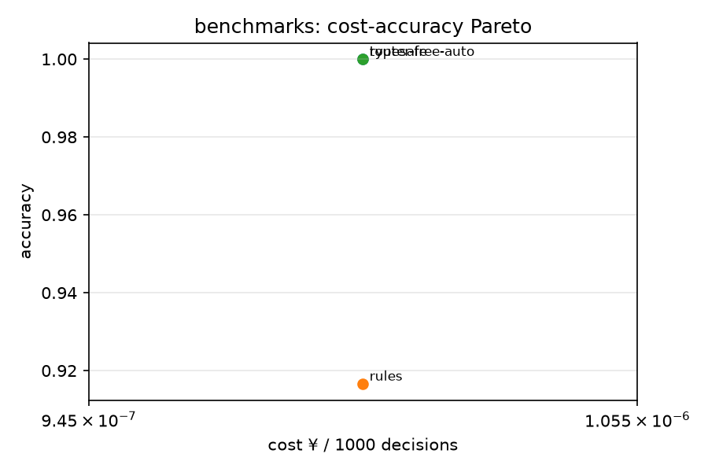

# judgekit 判官工具箱

[](https://github.com/lexingtonhibiki/judgekit/actions/workflows/ci.yml)
[](LICENSE)
[](pyproject.toml)

[English](README.md) | **简体中文**

> **System One（判官）模型的运行时判断引擎。**
> 一份 YAML 定义判断任务，原生跑在 TypeSafe Jev 的 decisions API 上，或自动翻译给任意
> OpenAI 兼容大模型——输出带校准概率的类型化决策，并告诉你每一个判断花了多少钱。

| 项目 | 回答的问题 | 时机 |
|---|---|---|
| [JudgeBench](https://github.com/ScalerLab/JudgeBench) (ICLR'25) / [JudgeLM](https://github.com/baaivision/JudgeLM) | 判官模型在难题上判断得**准不准** | 学术基准 |
| [DeepEval](https://github.com/confident-ai/deepeval) / [promptfoo](https://github.com/promptfoo/promptfoo) | LLM 输出在**测试时**过不过关 | 开发期/CI |
| [semantic-router](https://github.com/aurelio-labs/semantic-router) | 请求路由给哪个模型 | 运行时，仅路由 |
| **judgekit** | 生产环境的**每一个判断**花多少钱、可不可信 | **运行时判断层** |

一句话：**别人测判官聪不聪明，judgekit 让判断以可控成本常驻生产。**

## 评测基准（judge-econ）

judge-econ 测的是**成本-准确率**，不是聪明程度：同一批任务上对比各供应商的准确率、延迟、
每千次判断成本。据我们所知，这是**中文场景判官模型的第一批公开评测数字**
（[awesome-jev-zh](https://github.com/yzfly/awesome-jev-zh) 收录方明确把"中文场景没有公开评测"
列为当前缺口）。

### 数据集（人工构建 mini 集，v0.1）

| 数据集 | n | 任务 | 说明 |
|---|---|---|---|
| `intent_zh` | 40 | route：电商工单→部门 | 退款售后 / 物流 / 投诉 / 故障 / 咨询 |
| `sentiment_zh` | 30 | classify：评论情感 | 正面 / 负面 |
| `spam_zh` | 30 | classify：评论垃圾识别 | 垃圾(广告导流/灌水) / 正常 |
| `urgency_zh` | 30 | classify：客服紧急度 | 紧急(安全/资损) / 非紧急 |

共 130 条，全部随仓库开源，每个都带关键词规则基线（`*.rules.yaml`）。
公共大数据集（ag_news / sst2）在路线图上，欢迎 PR 扩充。

### 评测协议

- 每样本 1 次判断调用；`temperature=0`；无 few-shot。
- 准确率附 **Wilson 95% 置信区间**（小样本诚实口径）。
- 成本 = 运行时供应商牌价（Jev：$0.042/MTok 输入，输出免费；每千次成本=总成本÷总次数）。
- 完全可复现：`python benchmarks/run_bench.py --models rules,typesafe --limit 0`。

### 结果（2026-09-20，n=130）

| 供应商 | 后端 | 准确率 (95% CI) | 延迟/次 | 每千次成本 |
|---|---|---|---|---|
| **typesafe**（Jev `jev-1.13.0`，原生 decisions API） | choice → 全量概率分布 | **97.7% [93.4–99.2%]**（127/130；**3 轮独立重复，0 判定漂移**） | **~890 ms** | **¥0.105** |
| glm-5.3-flash（智谱 coding-plan 端点） | OpenAI 兼容 | 97.7%（127/130；与 Jev 共享 3 个误判中的 2 个） | ~4.0 s | ¥0（订阅） |
| deepseek-flash（官方 API） | OpenAI 兼容 | 96.2%（125/130；**漏判 2 条紧急工单**） | ~1.1 s | 按量 |
| rules（关键词基线） | — | 91.5% [85.5–95.2%]（119/130） | ~0 ms | ¥0 |
| nanojev-local（NanoJev 0.6B，[开源复刻](https://github.com/TianyuCodings/NanoJev)，本机 GPU 实测） | 本地 decisions API | 61.5%（80/130；英文游戏域零样本跨中文域） | **~220 ms** | ¥0 |

解读：Jev 与大得多的 GLM-5.3-flash 精度持平、**延迟只有 1/4.5**，且 3 轮零漂移
（temperature=0 下完全确定）；关键词基线 91.5% 依然能打——传统基线没有死。
错误重叠：Jev 与 GLM 共享同样 2 个真边界误判；DeepSeek 另漏判 2 条紧急工单
（u009/u011），这是客服派单场景里代价最高的错误类型。



### 发现：Jev 的校准概率是真校准

全部 3 个误判的置信度都**低于 0.7**（0.63 / 0.42 / 0.37），而低置信输出总共只占 9.2%：

> **在 0.7 处设一道置信度门控，就能以"9% 的判断交给免费规则兜底"为代价，捕获 100% 的错误。**
> 这正是 judgekit 的 Task 抽象强制推行的"原子任务 + 置信度门控 + 显式兜底"模式——与社区
> 钓鱼评测的结论一致（拆原子信号+代码组合 95.0% vs 复合问题直问 62.6%）。

误判明细见 [errors.json](docs/errors.json)：1 条标注本身模糊（保修政策咨询）、
1 条软广漏检、1 条负评被误判垃圾——全是真边界样本，且全部低置信。

### 外部候选集 v4（冻结中）

 可引用成绩（120 直标，`gold_spam120`）：
 - argmax 60.0%（72/120，95% CI [51.1%, 68.3%]）/ τ=0.10 68.3%（82/120，Youden最优，in-sample，无留出）。
 - 概率阈值实验说明：[docs/release-post-v0.3.md](docs/release-post-v0.3.md)——argmax 会丢弃概率分布中的分离信号；阈值校准是零重训杠杆。
 - 其余探索口径（190 系混合 gold，已被取代）见报告附录 `docs/jev-v4-report.md` §5.2，不引用。

 上方 judge-econ 头条数字不变。

## 快速开始

```bash
git clone https://github.com/lexingtonhibiki/judgekit && cd judgekit
pip install -e .              # 唯一硬依赖 pyyaml；装好后有 judgekit 命令
cp .env.example .env          # 可选：填 TYPESAFE_API_KEY（不填走规则兜底，0 成本）

# ⓪ 10 秒试用——不要数据文件、不要 key（规则兜底 0 成本）；退出码 0/1 可直接做 shell 门
judgekit judge judgekit/examples/triage.yaml "我的订单三天了还没发货，再不处理就投诉了"

# ① 一份 YAML，跑一个派单判断（无 key 自动规则兜底）
judgekit run judgekit/examples/triage.yaml --input benchmarks/data/econ_zh/intent_zh.jsonl --limit 3

# ⓪b 工作流管道与 CI 门禁：stdin 读入；ok 率低于 80% 退出码 2
cat tickets.jsonl | judgekit run judgekit/examples/triage.yaml --input - --fail-under 80

# ② 同一份 YAML 原生跑 Jev（choice/score/noul，全量概率分布）
export TYPESAFE_API_KEY=...
judgekit run judgekit/examples/triage.yaml --providers benchmarks/models.yaml --provider typesafe \
  --input benchmarks/data/econ_zh/intent_zh.jsonl --limit 3

# ③ 全量评测 + Pareto 报告
python benchmarks/run_bench.py --models rules,typesafe --limit 0 \
  --datasets intent_zh,sentiment_zh,spam_zh,urgency_zh    # n=130，头条数字的同款配方
python benchmarks/report.py   # → benchmarks/results/（发布时手工拷贝到 docs/）

# ④ 配方（默认本地启发式 0 成本；--model 开判官精排）
python recipes/learn_next/next.py --model typesafe --top 3
python recipes/resume_lens/match.py --model typesafe
```

## 同一份任务定义，任意后端

```yaml
name: 工单派单
primitive: route
criteria: 判断该求助内容应流转到哪个部门
labels:                       # map 写法：候选→说明
  退款售后: 退货、退款、换货、发票、赔偿
  物流查询: 快递、运单、发货进度、签收
provider: typesafe            # 换成任意 openai 兼容供应商名即切后端，YAML 零改动
fallback_rules:               # 供应商失败/无 key 时的零成本兜底
  退款售后: [退款, 退货, 换货, 发票]
```

- **typesafe 后端**：原生 choice criteria、score 刻度（归一化到 0-1）、verify→noul，
  返回全量概率分布与 confidence
- **openai 后端**：同一份 YAML 自动翻译成「只输出 JSON」的提示词（含刻度锚点），响应解析+标签校验
- **rules 后端**：在任务声明的 `input_field`（默认 `text`）上做关键词匹配，永远免费；
  兜底只对 classify/route 生效——score/verify 供应商失败即失败
- **单输入字段白名单**：规则匹配与 LLM 提示词只看声明字段，jsonl 里的金标/元数据
  不会泄漏进提示词，也不会虚增命中率

## 供应商（bring your own）

`benchmarks/models.yaml` 声明：`kind: typesafe | openai | rules`。key 只走环境变量
（`.env.example` 模板），**永不入库**。没有国外渠道完全成立：任何 OpenAI 兼容端点
（本地网关 / GLM / DeepSeek / OpenRouter…）都能跑通全链路，Jev 只是其中一家。

## 配方四原则

1. 判官给概率，人做决定（涉人场景强制意愿/知情前置）
2. 不做员工逐人标签；不做企业侧自动淘汰
3. 每个配方必须带零成本本地模式——判官是增强，不是依赖
4. 成本透明：每次运行打印本次判官花费

## 开发

```bash
pip install -e .[dev]
pytest               # 124 个离线单元测试（1 个 live-ping 默认跳过）
```

CI 在 Ubuntu/Windows × Python 3.10/3.12 上跑测试 + 零成本烟测。

## 路线图

- [x] 四原语引擎 + 原生 TypeSafe 适配器 + OpenAI 兼容 + 规则兜底
- [x] judge-econ mini 基准 + Pareto 报告（Jev 97.7% @ ¥0.105/千次，n=130）
- [x] 置信度门控研究（0.7 门控 → 捕获 100% 错误 @ 9% 升级率）
- [x] learn_next / resume_lens 配方（双模式）
- [x] 测试套件 + CI
- [ ] LLM 判官对照全量补测（GLM / DeepSeek / 免费链）
- [ ] 公共大数据集（ag_news / sst2 / 客服意图全量）
- [ ] smart-triage 配方（12345 政务热线派单）
- [ ] PyPI 发布 / GIF 演示

## 贡献

配方欢迎 PR（放 `recipes/`，遵守四原则）；基准数据欢迎扩充（放 `benchmarks/data/`，
带 `.rules.yaml` 基线）；新供应商适配欢迎 PR（`judgekit/providers/`，
实现 `decide(task, x) -> Decision` 即可）。

## License

MIT
